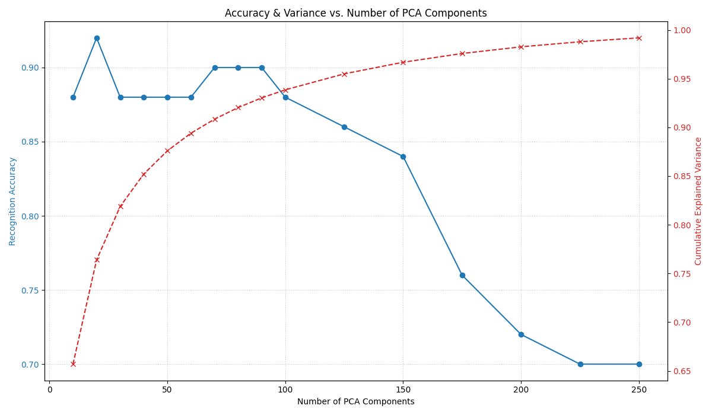
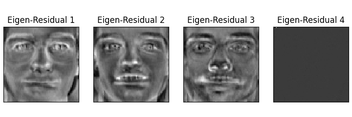

## PCA for Face Recognition

### Introduction

Face recognition stands as a cornerstone application in contemporary computer vision, demanding both accuracy and efficiency. In this project, PCA was employed to construct a compact, informative subspace—commonly referred to as the “face space”—in which facial images can be effectively represented and compared. By projecting high-dimensional image data into a lower-dimensional basis of eigenfaces (faces that can be linearly combined to represent all others), our objective was to explore the trade‐off between dimensionality reduction and recognition performance, characterizing how the number of principal components influences both explained variance and classification accuracy. The system operates on the Olivetti faces dataset, available through the `sklearn.datasets` library, and employs PCA for dimensionality reduction and feature extraction, followed by a nearest neighbor approach for face matching. The dataset contains 400 grayscale images of 40 distinct subjects (10 images per subject), each of size 64x64 pixels. In our experiments, the dataset was split into a training set of 350 images, and a test set of the remaining 50 images. 

In the context of face recognition, PCA was used to:
- Reduce dimensionality, since each 64x64 image is initially represented as a vector of 4096 pixels, and PCA was used to reduce this high-dimensional space. 
- Extract key features. When we reshape the obtained principal components back to the original image dimensions, we obtain what we called ‘eigenfaces’. These eigenfaces represent the fundamental variations across the faces in the training set. In other words, all faces in the dataset can be approximated as a linear combination of these eigenfaces. 
- Reduce noise. By retaining only the components with the highest variance, PCA can filter out some noise present in the original images. 

The `sklearn.decomposition.PCA` class was used, with the `whiten=True` parameter being passed to scale the principal components to have unit variance. This can improve the downstream classifiers by ensuring that all components are treated with equal importance, but it also means that later, potentially noisier components are given the same scale as earlier, more significant ones. After training the PCA model on the training faces and transforming both training and test faces into the lower-dimensional PCA space (called  ‘compressed’ faces in the notebook), recognition is performed using a nearest neighbor approach:

- For each compressed test face, its squared Euclidean distance to every compressed training face is calculated.
- The training face with the minimum Euclidean distance is considered the "best match."
- The identity (person ID) of this best-matched training face is assigned as the predicted identity for the test face.

### Analysis 

A crucial aspect of PCA is selecting the number of principal components to retain. Too few components might discard valuable information, leading to underfitting and poor discrimination. Too many components might retain noise or less relevant variations, potentially leading to overfitting to the training set and reduced generalization performance on the test set. The proposed script systematically evaluates the recognition accuracy for a range of  `n_components` values (e.g., from 10 up to 250, in steps). For each `n_component` a PCA model is trained, Training and test data are transformed, Recognition accuracy on the test set is calculated, and the cumulative explained variance for `n_c` components is also recorded. The `n_components` value that yields the highest accuracy on the test set is chosen as the optimal value for the final detailed evaluation.

The figure above plots the cumulative explained variance against the number of PCA components, revealing that the first twenty eigenfaces account for roughly seventy‐five percent of the total variance. The curve does not exhibit a clear ‘elbow’ point, although the returns in variance are clearly increasingly diminishing. Nevertheless, finer facial details continue to be encoded as components are added, motivating an empirical investigation into how these additional components affect recognition performance.

The figure above presents recognition accuracy as a function of the number of PCA components. Accuracy initially increases with more components (as more discriminative information is captured), but then tends to peak and then decline as the number of components continue to increase towards explaining 100% of the variance. Accuracy peaks at 92% with 20 components, and drops down to around 70% with 250 components. This exemplifies the inclusion of noise and irrelevant variations as the number of components grow: the first few components capture most of the variance in the data and that are likely related to underlying structures such as general face shapes and other major features, while later components capture progressively less variance and likely represent minor illumination changes, subtle expression variations, or details highly specific to the training samples rather than generalizable facial features. Including too many of these later components leads to the inclusion of noise and irrelevant detail into the feature representation. 

### Eigenfaces

Additionally, the Curse of Dimensionality is also present in a bigger number of components, although in a modified sense. If we retain a very large number of principal components, the dimensionality of the feature space itself can still be relatively high. In high-dimensional spaces, the concept of distance can become less intuitive, and the distance between any two points can become more uniform, making it harder for a nearest–neighbor classifier (like the one employed here) to distinguish between genuinely similar faces and coincidentally close ones in the high-dimensional (but noisy) feature space. The matching process might become sensitive to these non-generalizable features, and a test image might be incorrectly matched based on similarity in these noisy dimensions rather than fundamental facial structures.

The figure above displays the first twelve eigenfaces, each revealing characteristic facial patterns. The leading eigenface represents the global illumination trend and average facial structure. Subsequent components highlight localized variations such as the prominence of glasses, the shape of the mouth, and the contour of the eyes. These visualizations confirm that PCA extracts interpretable features aligning with meaningful facial attributes, which collectively form the axes along which individual identities can be distinguished.

With twenty components selected, the confusion matrix in the figure above details the distribution of classification outcomes across all identities. A majority of identities lie firmly along the main diagonal, indicating correct classification, while a handful of off‐diagonal entries signal systematic confusions. For example, person P9 was sometimes misclassified as P15, suggesting similarity in features that are captured within the chosen subspace. Such misclassifications guide further refinement, whether by increasing dataset diversity, adjusting the distance metric, or exploring alternative subspace selection strategies.

To illustrate typical and challenging cases, the figures above juxtapose a series of test samples with their best training matches under the twenty‐component model. In most instances, the reconstruction faithfully retrieves the correct identity, as evidenced by subtle alignments in facial structure and expression. Two highlighted cases show an incorrect match: a test image of P0 is aligned with a P28 image, and the test image of P22 is aligned with a P25 image, reflecting the relatively little confusion observed in the quantitative matrix. This example reinforces the importance of examining both global metrics and individual errors. To gain deeper insights into the types of errors made by the primary PCA-based recognition system, an additional analysis was performed on the residuals of misclassified instances. This analysis was made guided by the rationale that, when a face recognition system misclassified an image, it implies that the feature representation generated by the model (in this case the PCA projection) failed to capture or correctly emphasize the discriminative information for that particular instance, or that it was overly sensitive to non-discriminative features. Our aim was to extract the discriminative information that was not correctly captured or appropriately emphasized by treating the errors themselves as new faces and applying PCA again, essentially recovering the “principal components of the model’s mistakes” and potentially visualizing facial regions or features that were consistently misunderstood. 

### Residual Analysis

Therefore, to understand the systematic errors of our PCA-based recognition, we isolated all misclassified test samples and computed their residual images by subtracting each reconstructed face (projected into the 20-dimensional subspace) from its original. We then performed PCA on this residual dataset to extract eigen-residuals—principal modes of the information the primary model failed to capture. The figure below displays the first four eigen-residuals. The first component accentuates broad illumination mismatches, particularly around the forehead and cheek regions, indicating that global lighting subtleties are not fully represented. It also broadly highlights the areas around the eyebrows and eyelashes, suggesting error exposure in these regions of the face. The second component highlights discrepancies around the mouth nostrils, and chin, revealing consistent reconstruction errors in lip curvature and jaw contours. The third eigen-residual brings forth artifacts in the eye and glasses regions, suggesting that high-frequency details of eyewear and eye boundaries are underrepresented in the main eigenface subspace. The fourth component is nearly zero, implying that the dominant error patterns are well summarized by the first three residual modes.

Lastly, the figure below shows the cumulative explained variance of these eigen-residuals. Notably, the first three components account for the vast majority of residual variance, confirming that a small set of targeted basis functions can capture the salient reconstruction errors. This insight suggests that augmenting the original face space with just a few residual-specific components—or incorporating localized basis functions around key facial regions—could significantly reduce systematic misrepresentation and improve recognition robustness.

### Conclusion

Through systematic evaluation of PCA‐based face matching, this project shows that a moderate number of principal components—around twenty—strikes an effective balance between capturing sufficient variance and maintaining robust classification accuracy. Eigenfaces afford interpretable dimensions of variation, while confusion analysis and qualitative examples illuminate residual challenges. Residual-based PCA further uncovers specific error patterns, offering a principled path toward enhancing face representation. Future work may explore kernel extensions, manifold learning, or hybrid models that integrate eigen-residual feedback to minimize systematic reconstruction shortcomings.
